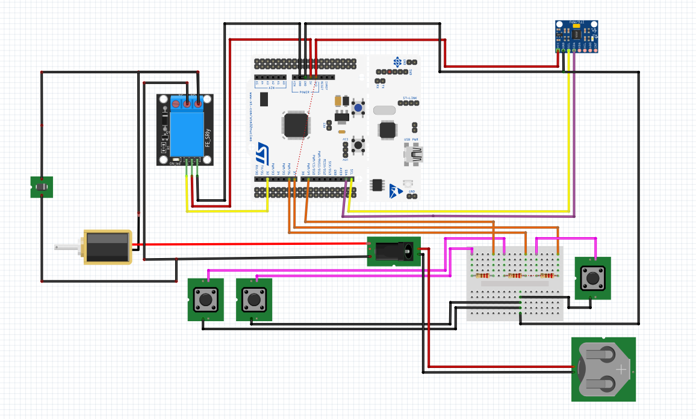
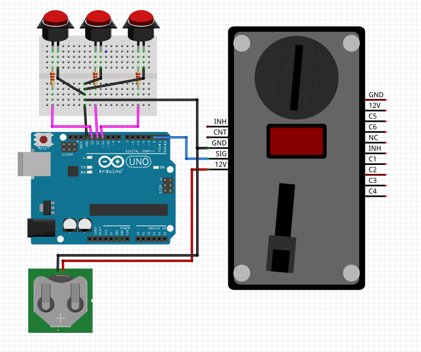

# 포팅 매뉴얼

## 1. 포팅 방법

### 1) 게임 컨트롤러 (Gun Controller)

- 주요 하드웨어
    - 보드 : STM32 Nucleo Board
    - MCU : STM32F103RB (ARM Cortex-M3)
    - MPU6050
    - 1채널 릴레이 스위치
    - 솔레노이드
    - 12V DC 전원
    - 청축 스위치 3개
    
- 회로도 연결
    
    
    

- 포팅 방법 
    - STM32CubeIDE 버전 : 1.15.0
    - 아래 링크에서 제공되는 Firmware를 STM32CubeIDE를 활용하여 STM32 보드에 적재
    - 링크 : [Game Controller Firmware](../firmware)
    

 

### 2) 게임 디바이스 (SBOX)

- 주요 하드웨어
    - Arduino Uno R3
    - 버튼 3개
    - 동전투입기
    - 12V DC 전원

- 회로도
    
    
    

- 포팅 방법
    - 아래 링크에서 제공되는 Firmware를 Arduino 보드에 적재 
    - 링크 : [Game Device Firmware](../StartButton)

 

### 3) 게임 다운로드 (Artificial Inferno)

- 주요 하드웨어 : 게임을 실행할 수 있는 사양에 맞는 게이밍 보드

 

- 포팅 방법
    - Unity Engine 버전 : 2022.3.24f1

    - 아래 링크에서 제공되는 게임 다운로드 

    - 링크 : [Game Firmware](../game)

 

## 2. 사용 매뉴얼 (조작 방법)

### 1) 게임 환경 세팅

- SBOX에 내장된 게이밍 보드와 건 컨트롤러 연결 (Mini to USB)
- SBOX에 내장된 게이밍 보드와 Arduino 연결 (이미 연결되어 제공)

 

### 2) Gun Controller 조작법 

- 우측 측면 앞쪽 버튼 : 영점 조절 기능
- 우측 측면 뒷쪽 버튼 : 장전 기능
- 방아쇠 : 사격 및 확인 기능

 

### 3) SBOX 조작법

- SBOX의 전원선 연결
- 동전 삽입 (500원만 인식)
- 1P/2P 버튼을 눌러 플레이 모드 선택

 

### 4) 게임 플레이 방법

게임의 최종목표는 반란 A.I의 모체를 찾아 파괴하는 것입니다.
플레이어는 빅스비의 조력으로, 로봇들에게 명령을 내리는 모체를 파괴해
AI사태를 종료하는 임무를 수행합니다.

- 마우스로 플레이하는 경우
    - 좌클릭 : 사격
    - 우클릭 : 재장전
    - 스페이스바 : 게임 코인 충전

- 건 컨트롤러로 플레이하는 경우
    - Gun Controller 조작법 참고
